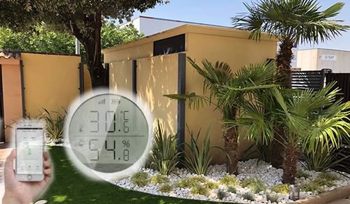
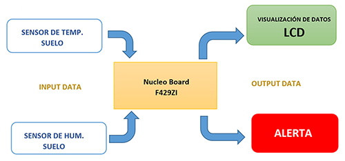
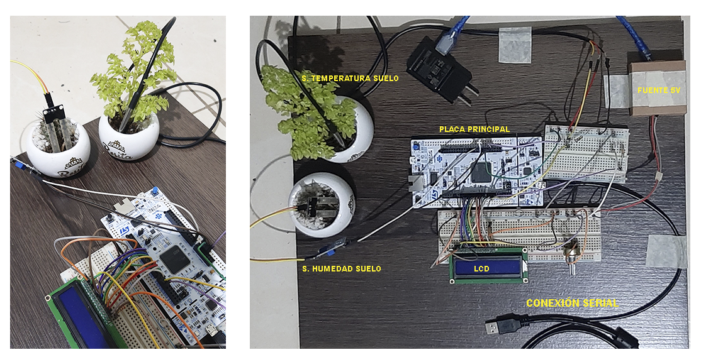

## TP ISE - IOT (UBA)

Autor:
* Iván Cruz Flores (ivan17cf@gmail.com)

Docentes:

* Ing. Juan Manuel Reta
* Ing. Eduardo Filomena

## TEMA:  Sistema de monitoreo de temperatura y humedad del suelo.

El agua es vida y en el caso de las plantas disuelve los minerales y nutrientes que se encuentran en estado sólido en los suelos, permitiendo su absorción a través de las raíces. De modo que el agua es determinante en el crecimiento y desarrollo de las plantas.

Medir la humedad del terreno es la mejor forma de saber las verdaderas necesidades de riego de un huerto o jardín. Llamamos humedad del suelo a la cantidad de agua por volumen de tierra que hay en un terreno.

<p align="center">
    
</p>

La constante medición y control de la humedad del terreno es elemental, ya que tanto el exceso, como la falta de agua, son dañinos para las plantas. 
Con este proyecto se busca monitorear los factores variables de humedad y temperatura de suelo para su aplicación en el cuidado de plantas en el rubro de paisajismo.

El sistema está compuesto por 2 sensores principales, el sensor digital DS1820 de temperatura de suelo y el sensor analógico YL-69 de humedad de suelo usando el una placa ARM del NUCLEO-F429ZI.

<p align="center">
    
</p>

## Componentes hardware: 

El prototipo esta compuesto por los siguientes elementos:

* 1 sensor Digital DS1820 de temperatura de suelo.
* 1 sensor Analogico YL-69 de humedad de suelo.
* 1 pantalla LCD 16x2.
* 1 placa principal ARM del NUCLEO-F429ZI.
* 1 fuente externa de entrada 220v y salida 5V.
* 1 cable usb para la comunicación serial con el pc de monitoreo.
* 1 diodo led color rojo para alertas.
* 1 pootenciometro de 10K ohm para el brillo del lcd.
* 2 resistencias de 220 ohm.
* 1 resistencia de 4.7K ohm.
* 2 protoboard.
* 2 mini macetas de prueba.

## Componentes software: 

El prototipo esta compuesto por los siguientes elementos:


* El compilador de la plataforma de desarrollo online: https://os.mbed.com/.
* Lenguaje de programación C/C++.
* Software Cool MacOS Terminal para la interfaz serial.

## Esquemático de conexión

<p align="center">
    
</p>

Para tener una mejor resolución de las conexiones se incluye un documento en pdf con una mejor calidad y puede revisarlo desde el siguiente enlace:

<p align="center">
    <a href="imagenes/diagrama_conexiones.pdf" target="_blank"></a>
</p>


El código fuente en este repositorio es una copia exportada de la versión original de la plataforma de os.mbed y si desea revisar el código directamente desde el origen de os.mbed puede ingresar desde el siguiente enlace:

<p align="center">
    <a href="https://ide.mbed.com/compiler/#nav:/Ejemplo_TP_ISE_final;" target="_blank"></a>
</p>


## Imagenes del prototipo 

Vistas del prototipo:

<p align="center">
    <br>

</p>

## Test de funcionamiento 01

* <b>CASO calor extremo:</b> si el sensor de humedad marca sequedad (cercano a 1.0 %) y con temperatura alta en el suelo (superior a 25 °C.

```
CONDICIÓN:

 if ((cantidadHumedad >=0.7) && (cantTemperatura >= 25)) 
 
SALIDA SERIE:

alertaUpdate(1);
displayStringWrite( "AYUDA" );
printf("\n---- ¡Ayuda necesito mucha agua! ----\n ");

```


## Test de funcionamiento 02 

* CASO: 

## Test de funcionamiento 03 

* CASO:

<p align="center">
    <br>
    Enlace oficial: 
</p>

# Funcionamiento del prototipo 

En el siguiente video se muestra el Funcionamiento de lo aplicado durante la práctica:
<p align="center">
     .....
 </p>


